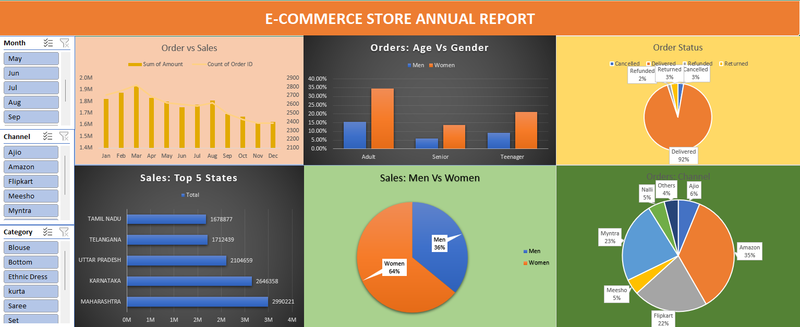

# 📊 E-commerce Store Data Analysis

## 🔹 Project Overview
This project focuses on analyzing retail store sales data using Microsoft Excel.  
The objective is to identify revenue trends, top-performing products, and region-wise performance insights.

---

## 🔹 Tools & Techniques Used
- Microsoft Excel
- Data Cleaning
- Pivot Tables
- Charts & Visualizations
- Dashboard Creation

---

## 🔹 Dataset Description
The dataset includes:
- Order ID
- Product Name
- Category
- Sales Amount
- Quantity Sold
- Region
- Order Date

---

## 🔹 Key Insights
- Identified monthly revenue trends.
- Analyzed top-selling products.
- Compared region-wise sales performance.
- Determined high-profit product categories.

---

## 🔹 Business Impact
The analysis helps in:
- Improving inventory planning.
- Increasing sales strategy efficiency.
- Identifying profitable regions and products.

---

## 🔹 Dashboard Preview
(Add your screenshot here)

---

## 🔹 How to Use
1. Download the Excel file.
2. Open in Microsoft Excel.
3. Navigate through dashboard sheets to explore insights.

---

## 👨‍💻 Author
Aakash Kumar